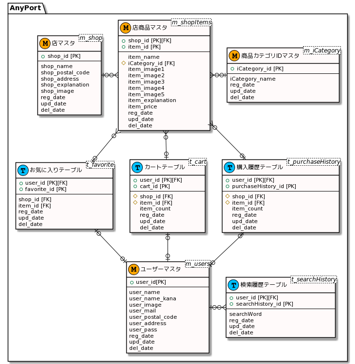

# DB定義書
## ER図
[ER図はこちら](https://github.com/aso2001036/kaihatu/blob/main/DB/ER%E5%9B%B3.md)

*****

*****

# データベース設計図

## m_users

|和名|属性名(カラム名)|型|PK|NN|FK|
|---|-----|--|--|--|--|
|ユーザーID|user_id|varchar(50)|○|○||
|ユーザー名|user_name|varchar(100)||○||
|ユーザー名(カナ)|user_name_kana|varchar(100)||○||
|ユーザー画像ファイル名|user_image|varchar(200)||||
|郵便番号|user_postal_code|varchar(7)||○||
|住所|user_address|varchar(100)||○||
|メールアドレス|user_mail|varchar(100)||○||
|パスワード|user_pass|varchar(50)||○||
|登録日|reg_date|datetime||○||
|更新日|upd_date|datetime||||
|削除日|del_date|datetime||||

## m_pre_users

|和名|属性名(カラム名)|型|PK|NN|FK|
|---|-----|--|--|--|--|
|ユーザーID|user_id|int(8)|○|○||
|メールアドレス|pre_user_mail|varchar(100)||○||
|トークン|pre_user_token|varchar(50)||○||
|登録日|reg_date|datetime||○||
|更新日|upd_date|datetime||||
|削除日|del_date|datetime||||

## m_iCategoryId

|和名|属性名(カラム名)|型|PK|NN|FK|
|---|-----|--|--|--|--|
|商品カテゴリID|iCategory_id|int(8)|○|○||
|カテゴリ名|iCategory_name|varchar(100)||○||
|登録日|reg_date|datetime||○||
|更新日|upd_date|datetime||||
|削除日|del_date|datetime||||
## m_shop

|和名|属性名(カラム名)|型|PK|NN|FK|
|---|-----|--|--|--|--|
|ショップID|shop_id|int(8)|○|○||
|店名|shop_name|varchar(100)||○||
|郵便番号|shop_postal_code|varchar(7)||○||
|住所|shop_address|varchar(100)||○||
|店説明|shop_explanation|varchar(1000)||||
|店画像ファイル名|shop_image|varchar(200)||||
|登録日|reg_date|datetime||○||
|更新日|upd_date|datetime||||
|削除日|del_date|datetime||||

## m_shopItems

|和名|属性名(カラム名)|型|PK|NN|FK|
|---|-----|--|--|--|--|
|ショップID|shop_id|int(8)|○|○|○|
|商品ID|item_id|int(8)|○|○||
|商品名|item_name|varchar(100)||○||
|商品カテゴリID|iCategory_id|int(8)||○|○|
|商品画像ファイル名1|item_image1|varchar(200)||||
|商品画像ファイル名2|item_image2|varchar(200)||||
|商品画像ファイル名3|item_image3|varchar(200)||||
|商品画像ファイル名4|item_image4|varchar(200)||||
|商品画像ファイル名5|item_image5|varchar(200)||||
|商品説明|item_explanation|varchar(500)||||
|単価|item_price|int(30)||○||
|登録日|reg_date|datetime||○||
|更新日|upd_date|datetime||||
|削除日|del_date|datetime||||

## t_searchHistory

|和名|属性名(カラム名)|型|PK|NN|FK|
|---|-----|--|--|--|--|
|ユーザーID|user_id|varchar(50)|○|○||
|履歴ID|searchHistory_id|int(12)|○|○||
|検索ワード|searchWord|varchar(200)||○||
|登録日|reg_date|datetime||○||
|更新日|upd_date|datetime||||
|削除日|del_date|datetime||||

## t_favorite

|和名|属性名(カラム名)|型|PK|NN|FK|
|---|-----|--|--|--|--|
|お気に入りID|favorite_id|int(8)|○|○||
|ユーザーID|user_id|varchar(50)|○|○||
|ショップID|shop_id|int(8)||○|○|
|商品ID|item_id|int(8)||○|○|
|登録日|reg_date|datetime||○||
|更新日|upd_date|datetime||||
|削除日|del_date|datetime||||

## t_cart

|和名|属性名(カラム名)|型|PK|NN|FK|
|---|-----|--|--|--|--|
|カートID|cart_id|int(8)|○|○||
|ユーザーID|user_id|varchar(50)|○|○||
|ショップID|shop_id|int(8)||○|○|
|商品ID|item_id|int(8)||○|○|
|個数|item_count|int(50)||○||
|登録日|reg_date|datetime||○||
|更新日|upd_date|datetime||||
|削除日|del_date|datetime||||

## t_purchaseHistory

|和名|属性名(カラム名)|型|PK|NN|FK|
|---|-----|--|--|--|--|
|購入履歴ID|purchaseHistory_id|int(8)|○|○||
|ユーザーID|user_id|varchar(50)|○|○||
|ショップID|shop_id|int(8)||○|○|
|商品ID|item_id|int(8)||○|○|
|個数|item_count|int(50)||○||
|登録日|reg_date|datetime||○||
|更新日|upd_date|datetime||||
|削除日|del_date|datetime||||
