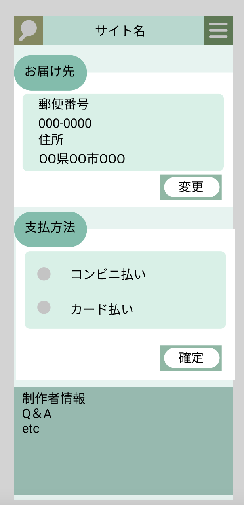

### 画面詳細図
## カテゴリ別　商品欄
### プロトタイプは以下のリンク先
[プロトタイプ](https://www.figma.com/file/5bAHMcKrDB8THLNT72si3d/%E7%94%BB%E9%9D%A2?node-id=53%3A85)
*****

*****
補足：対応DBの列はDB設計後、〇を対応するテーブル・カラム名に差し替えること。

|ID|要素|内容|アクション|イベント|対応DB|
|--|----|----|----------|--------|-----|
|1|検索テキスト表示ボタン|ボタン|クリック|検索欄表示|-|
|2|サイト名|テキストボタン|クリック|トップページへ移行|-    |
|3|メニュー欄表示ボタン|ボタン|クリック|メニュー欄表示||
|4|カテゴリ名|テキスト表示|-|-     |-|
|5|商品画像|ボタン|クリック|商品詳細へ移行|〇|
|6|表品名|ボタン|クリック|商品詳細へ移行||
|7|販売会社名|テキストボタン|クリック|カテゴリ別　商品欄へ移行|-|
|8|値段|テキストボタン|クリック|商品詳細へ移行|-|
|9|トップページ|ボタン|クリック|トップページへ移行|-|
|10|製作者情報|テキストボタン|クリック|製作者情報へ移行|-    |
|11|Q＆A|チテキストボタン|クリック|Q&Aへ移行|-|

