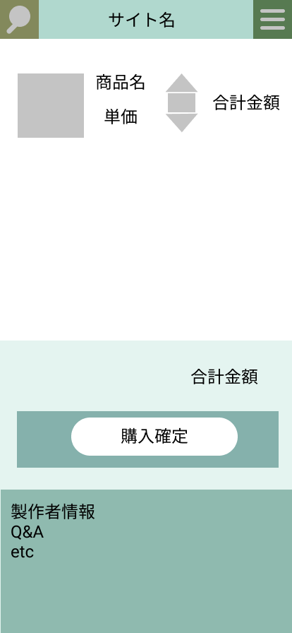

### 画面詳細図
## トップページ
### プロトタイプは以下のリンク先
[プロトタイプ](https://www.figma.com/file/5bAHMcKrDB8THLNT72si3d/%E7%94%BB%E9%9D%A2?node-id=0%3A1)
******

******
補足：対応DBの列はDB設計後、〇を対応するテーブル・カラムに差し替えること。

| ID | 要素 | 内容 | アクション | イベント |　たいおうDB |
|----|------|------|------------|---------|--------------|
|1|商品画像|画像|表示|商品の画像の表示|〇|
|2|サイト名|テキスト|クリック|トップページに戻る|-|
|3|制作者情報|ボタン|クリック|制作者情報ページへ移動|-       |
|4|Q&A|ボタン|クリック|Q&Aページへ移動|-       |
|5|ハンバーガーメニュー|クリック|メニューを表示させる|メニューページへ移動|-|
|6|商品名|テキスト|-|カートに入れている商品名の表示|〇|
|7|商品単価|テキスト|-|商品の単価の表示|〇|
|8|個数変更|ボタン|クリック|購入数の変更|-|
|9|単品合計金額|テキスト|-|購入数*単価|-|
|10|購入額|テキスト|-|カート内の単品合計金額の総和|-|
|11|購入確定|ボタン|クリック|お支払方法ページへの遷移|-|
