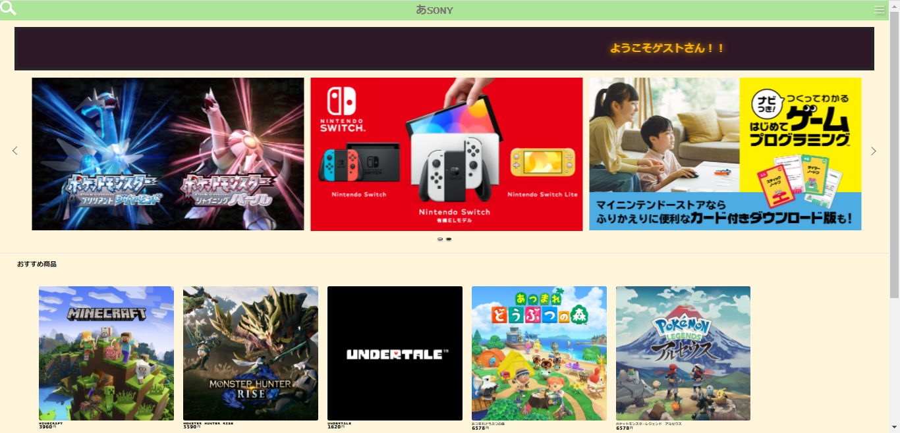

### 画面詳細図
## マイページ
### プロトタイプは以下のリンク先
[プロトタイプ](https://www.figma.com/file/5bAHMcKrDB8THLNT72si3d/%E7%94%BB%E9%9D%A2?node-id=53%3A85)
*****

*****
補足：対応DBの列はDB設計後、〇を対応するテーブル・カラム名に差し替えること。

|ID|要素|内容|アクション|イベント|対応DB|
|--|----|----|----------|--------|-----|
|2|サイト名|テキストボタン|クリック|トップページへ移行|-    |
|3|メニュー欄表示ボタン|ボタン|クリック|メニュー欄表示||
|4|お知らせ|お知らせ表示|スワイプ|次のお知らせ表示|-|
|5|おすすめ|おすすめ商品表示|スワイプ|他のおすすめ表示|-|
|6|人気商品|ボタン|クリック|商品詳細へ移行||
|8|氏名|テキスト|テキスト表示|-|-|
|9|氏名|テキストボックス|入力|-|-|

