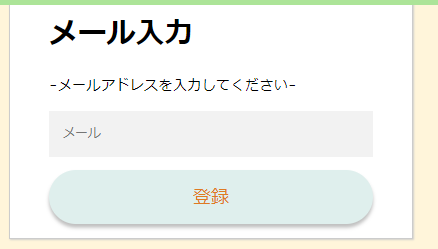

### 画面詳細図
## メール登録
### プロトタイプは以下のリンク先
[プロトタイプ](https://www.figma.com/file/5bAHMcKrDB8THLNT72si3d/%E7%94%BB%E9%9D%A2?node-id=0%3A1)
*****

*****

補足：対応DBの列はDB設計後、〇を対応するテーブル・カラム名に差し替えること。
| ID | 要素 | 内容 | アクション | イベント | 対応DB |
|----|-----|------|------------|-----------|-------|
|2   |メニュー|ボタン|クリック|メニューバナーの表示||
|3   |サイト名|ボタン|クリック|トップページへ移動|-       |
|4   |アドレス|テキスト|テキスト入力|-       |〇|
|10   |確認|ボタン|クリック|ログイン処理実行|-       |
