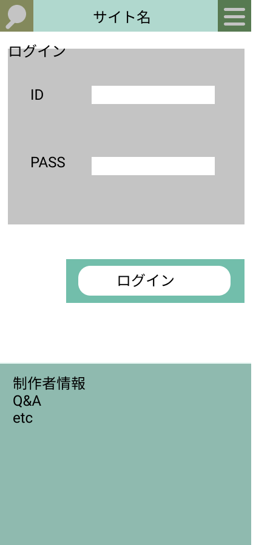

### 画面詳細図
## ログイン画面
### プロトタイプは以下のリンク先
[プロトタイプ](https://www.figma.com/file/5bAHMcKrDB8THLNT72si3d/%E7%94%BB%E9%9D%A2?node-id=0%3A1)
*****

*****

補足：対応DBの列はDB設計後、〇を対応するテーブル・カラム名に差し替えること。
| ID | 要素 | 内容 | アクション | イベント | 対応DB |
|----|-----|------|------------|-----------|-------|
|1   |検索|ボタン|クリック|検索欄の表示|-       |
|2   |メニュー|ボタン|クリック|メニューバナーの表示|-       |
|3   |サイト名|ボタン|クリック|トップページへ移動|-       |
|4   |ログイン|ボタン|クリック|ログインページへ移動|-       |
|5   |新規登録|ボタン|クリック|新規登録ページへ移動|-       |
|6   |制作者情報|ボタン|クリック|制作者情報ページへ移動|-       |
|7   |Q&A|ボタン|クリック|Q&Aページへ移動|-       |
