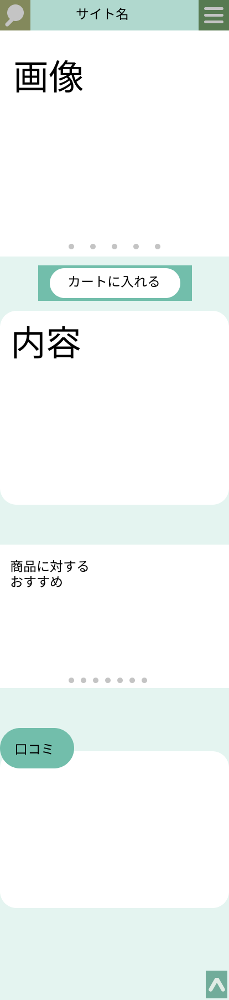

### 画面詳細図
## トップページ
### プロトタイプは以下のリンク先
[プロトタイプ](https://www.figma.com/file/5bAHMcKrDB8THLNT72si3d/%E7%94%BB%E9%9D%A2?node-id=0%3A1)
******

******
補足：対応DBの列はDB設計後、〇を対応するテーブル・カラムに差し替えること。

| ID | 要素 | 内容 | アクション | イベント |　たいおうDB |
|----|------|------|------------|---------|--------------|
|1|商品画像|画像|表示|商品の画像の表示|〇|
|2|カートに入れる|ボタン|クリック|表示している商品をカートページに保存|-|
|3|商品内容|テキスト|スクロール|表示している商品の詳細な情報の表示|〇|
|4|関連商品|画像|クリック|表示している商品の関連商品のリンク||
|5|サイト名|テキスト|クリック|トップページに戻る|-|
|6|口コミ|テキスト|スクロール|商品に対する評価の表示、書き込み|〇|
|7|制作者情報|ボタン|クリック|制作者情報ページへ移動|-       |
|8|Q&A|ボタン|クリック|Q&Aページへ移動|-       |
|9|ハンバーガーメニュー|クリック|メニューを表示させる|メニューページへ移動|-|
|||||||
|||||||
|||||||
