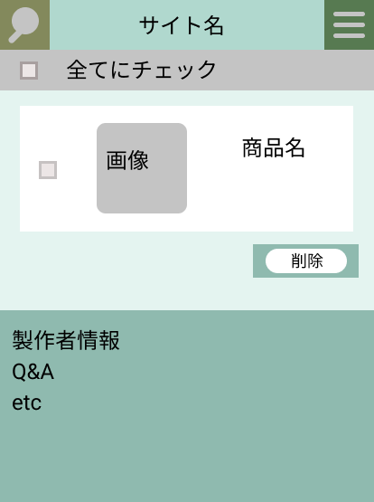

### 画面詳細図
## ログイン
### プロトタイプは以下のリンク先
[プロトタイプ](https://www.figma.com/file/5bAHMcKrDB8THLNT72si3d/%E7%94%BB%E9%9D%A2?node-id=0%3A1)
*****

*****

補足：対応DBの列はDB設計後、〇を対応するテーブル・カラム名に差し替えること。
|ID|要素|内容|アクション|イベント|対応DB|
|----|-----|-----|-----------|---------|-------|
|1|バナー|サイト名表示|-|-|-|
|2|全てにチェック|チェックボックス|クリック|-|-|
|3|商品履歴|チェックボックス|クリック|-|-|
|4|商品画像|画像表示|-|-|-|
|5|商品名|テキスト表示|-|-|-|
|6|削除|テキスト表示|-|-|-|
|7|製作者情報|テキストボタン|クリック|移動|-|
|8|Q&A|テキストボタン|クリック|移動|-| 
