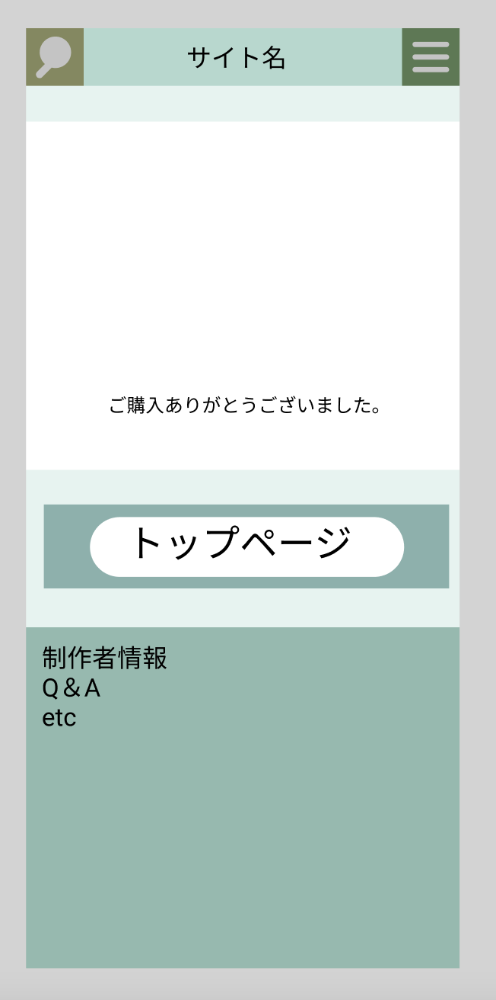

### 画面詳細図
## トップページ
### プロトタイプは以下のリンク先
[プロトタイプ](https://www.figma.com/file/5bAHMcKrDB8THLNT72si3d/%E7%94%BB%E9%9D%A2?node-id=0%3A1)
*****

*****

補足:対応DBの列はDB設計後、○を対応するテーブル・カラム名に差し替えること。

| ID | 検索 | 内容 | アクション | イベント | 対応DB |
|----|-----|-----|---------|--------|-------|
|1|検索アイコン|画像ボタン|クリック|検索窓表示|○|
|2|バナー|サイト名表示|-|-|-|
|3|ハンバーガーメニュー|ボタン|クリック|メニュー表示|-|
|4|購入ありがとうございました|テキスト表示|-|-|-|
|5|トップページボタン|ボタン|クリック|トップページへ遷移|-|
|6|作成者情報|テキストボタン|クリック|作成者情報ページ遷移|-|
|7|Q&A|テキストボタン|クリック|Q&Aページ遷移|-|
